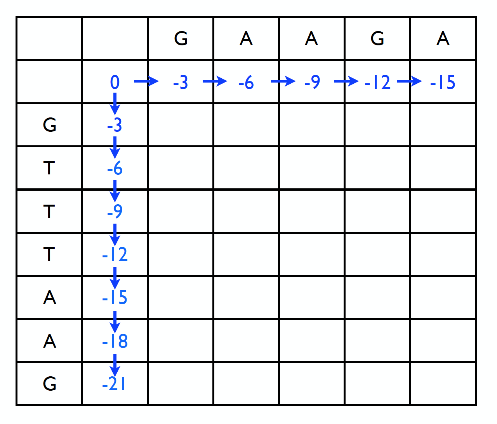

# Global And Local Alignment

## Global Alignment


There are 3 different cases of reaching (i,j) from (i-1, j-1), (i,j-1),or (i-1,j)

Scores(d, s(xi, yj)) refer to the score.txt file


Create a score matrix and a matrix that shows where it came from

With DP refering scores, record it in order.


## Local Alignment

### Not Affine


Comparing global alignment, values smaller than 0 are zero because you don't know where to start.

So this is how it works

### Affine Gap Scores


They don't look different, but the left figure is inserted twice and other is inserted once. So, the left one should have relatively large penalty.


Comparing global alignment, it needs new design because the direction that comes has become more diverse. And the starting open penalty value must be greater than the extension penalty.


## Global Alignment Implementation

```
# global alignment
# matrix initialization
matrix = []
for i in range(len(seq1_str)) :
    tmp = []
    for j in range(len(seq2_str)) :
        tmp.append(0)
    matrix.append(tmp)

for i in range(len(seq1_str)):
    matrix[i][0] = i * gap

for j in range(len(seq2_str)):
    matrix[0][j] = j * gap

#backtrack initialization
backtrack = []
for i in range(len(seq1_str)) :
    tmp = []
    for j in range(len(seq2_str)) :
        tmp.append("N")
    backtrack.append(tmp)
```



when gap penalty is 3, This is how it is initialized.


```
# LCS backtrack
for i in range(1, len(seq1_str)) :
    for j in range(1, len(seq2_str)) :
        if seq1_str[i] == seq2_str[j] :
            target = match
        else :
            target = mismatch

        matrix[i][j] = max([matrix[i-1][j] + gap , matrix[i][j-1] + gap, matrix[i-1][j-1] + target])
        if matrix[i][j] == matrix[i - 1][j] + gap:
            backtrack[i][j] = "down"
        elif matrix[i][j] == matrix[i][j - 1] + gap:
            backtrack[i][j] = "right"
        elif matrix[i][j] == matrix[i - 1][j - 1] + target:
            backtrack[i][j] = "diagonal"
```


## Local Alignment Implementation

```
# LCS Backtrack
for i in range(1, len(seq1_str)) :
    for j in range(1, len(seq2_str)) :
        if seq1_str[i] == seq2_str[j]:
            target = match
        else:
            target = mismatch

        matrix[i][j] = max([0, matrix[i - 1][j] + gap, matrix[i][j - 1] + gap, matrix[i - 1][j - 1] + target])
        if matrix[i][j] == matrix[i - 1][j] + gap:
            backtrack[i][j] = "down"
        elif matrix[i][j] == matrix[i][j - 1] + gap:
            backtrack[i][j] = "right"
        elif matrix[i][j] == matrix[i - 1][j - 1] + target:
            backtrack[i][j] = "diagonal"
```

The difference is the addition of zero to max list.

## Affine Gap Scores Implementation

```
# LCS Backtrack (diagonal)
for idx_i in range(1, len(seq1_str) + len(seq2_str)) :
    for idx_j in range(len(seq2_str)-1) :
        i = idx_i - idx_j
        j = idx_j + 1
        if i < 1:
            break
        if i >= len(seq1_str) :
            continue

        if seq1_str[i] == seq2_str[j]:
            target = match
        else:
            target = mismatch

        matrix[i][j][0] = max([matrix[i - 1][j][0] - extension_penalty, matrix[i - 1][j][1] - open_penalty])
        matrix[i][j][2] = max([matrix[i][j - 1][2] - extension_penalty, matrix[i][j - 1][1] - open_penalty])

        matrix[i][j][1] = max([matrix[i][j][0], matrix[i][j][2], matrix[i - 1][j - 1][1] + target])
        if matrix[i][j][1] == matrix[i][j][0]:
            backtrack[i][j] = "down"
        elif matrix[i][j][1] == matrix[i][j][2]:
            backtrack[i][j] = "right"
        elif matrix[i][j][1] == matrix[i - 1][j - 1][1] + target:
            backtrack[i][j] = "diagonal"
```

Previously, the procession was filled with values in order from the first line. But this time it's filled diagonally.

(ex. (1,1) -> (2,1) , (1,2) -> (3,1) , (2,2) ,(1,3) -> …. )

The score matrix was also increased to three to represent lower, midle, and upper.


## Execution


There are two sequences that seq1.txt and seq2.txt compare each other, and the score can be found through score.txt.

```
$ python3 alignment.py
```

Let's execute the file. (python 3.6)

```
>seq1  AACTGAGTCA
>seq2  ACCCCCTGAGAGTTCT
============GLOBAL ALIGNMENT===========
AAC---TGAG--T-CA
ACCCCCTGAGAGTTCT
matches : 8
mismatches : 2
gaps : 6
scores : 4
======LOCAL ALIGNMENT(not affine)======
AACTGAG--T-CA
ACCTGAGAGTTCT
matches : 8
mismatches : 2
gaps : 3
scores : 11
```

It prints out what global alignment and local alignment look like, up to the point.

```
*****************Enter the penalties***************
(extension penalty is less than the open penalty)
example : open_penalty : 3, extension_penalty : 1

open_penalty : 3
extension_penalty : 1
========LOCAL ALIGNMENT(affine)========
AACTGAG---TCA
A-CTGAGAGTTCT
matches : 8
mismatches : 1
gaps : 4
scores : 13
```

Furthermore, the local alignment with affine gap scores needs user input to open and extension penalties. You can know the result after you enter it.